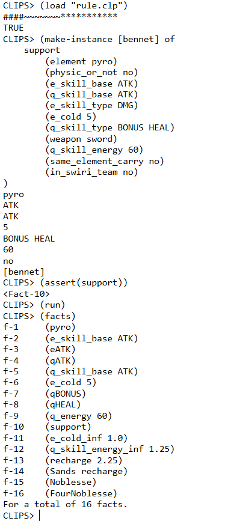
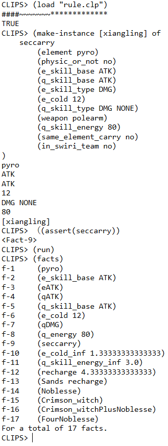
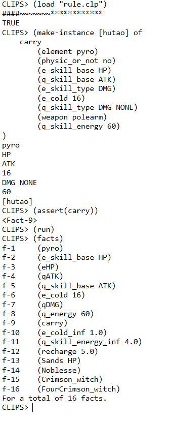

# 课程报告

人工智能A 课程报告 18307130104 赵文轩

## 项目说明

本项目构思了一个专家系统，并实现了其中一个模块作为示例，用于为游戏《原神》提供一个基于专家系统的圣遗物（游戏中的装备系统）推荐机制，包括：圣遗物套装推荐（包括 4 件套，2 + 2 套装），沙漏主属性推荐。

实现的模块以火元素的三个角色为例，通过专家系统对于这三个输入的分析过程，具体阐述整个系统的运作过程。其中 [rule.clp](./rule.clp) 包括了专家系统中类和规则的定义，[run.clp](./run.clp) 包括了三个输入。由于其他元素的规则与火元素类似，因此不再做编程展示。

整个系统用 CLIPS 6.4 实现，在 Windows 10 操作系统下使用 CLIPS IDE 进行调试运行。

## 项目结果展示



对于班尼特（bennet 的中文角色名），建议四件套宗室套装，沙漏选择充能，对应 f-14，f-16。



对于香菱（xianging），采用二魔女加二宗室套装或宗室4件套，沙漏采用充能，对应 f-13，f-15，f-16。



对于胡桃（hutao）采用魔女四件套，沙漏选择生命，对应 f-13，f-16。

## 选题说明

圣遗物系统是原神中非常重要的系统，圣遗物的正确选择对于角色的培养有重大意义，虽然圣遗物系统的养成周期长，养成成本高，但是圣遗物套装的选择却是一个非常模式化的流程，这一点和专家系统要求领域狭窄的特点非常符合，因此我将圣遗物套装的选择作为本次人工智能A课程期末课程的选题。

接下来对于圣遗物系统进行基本的阐述，以便理解整个专家系统的流程和目的。

人物分别属于风（Anemo），岩（Geo），火（Cryo），雷（Electro），水（Hydro），冰（Cryo）六个元素之一，武器为单手剑（Sword），双手剑（Claymore），长柄武器（Polearm），法器（Catalyst），弓（Bow）五种之一。

圣遗物系统允许玩家为角色装备五个圣遗物：花，羽毛，沙漏，头，杯。每个圣遗物有一个主词条和三到四个副词条。每个词条的属性都不相同，有暴击率（CRIT RATE），暴击伤害（CRIT DMG），固定生命值（HP），百分比生命值，固定防御力（DEF），百分比防御力，固定攻击力（ATK），百分比攻击力，元素充能效率（Recharge），元素精通（Elemental Mastery）。

圣遗物中花和羽毛的主属性是固定，头，杯子的主属性选择也相对固定，因此唯一需要抉择的是沙漏，沙漏的主属性选择比较多样，以充能效率和攻击为主，也包括其他可能的属性。

圣遗物套装是一个组合机制，每个圣遗物都会属于一个套装，如果同时装备同一套装的 2件 或 4件 圣遗物，就会触发加成。由于总共只能装备 5件 圣遗物，因此圣遗物套装的搭配一般是 2 + 2 + 1散件或者 4 + 1 散件。选择合适的圣遗物套装组合，再投入体力对圣遗物进行刷取，才能能快地养成角色。

## 实现方式

整个专家系统混合采用了规则和面向对象两种专家系统。

大类 position，定义了人物地基本属性，包括元素，是否为物理输出角色，技能加成方式，技能冷却时间，技能所需元素点数等等。position 被 carry，seccarry，support 三个类继承，分别代表了 C位，副C位，辅助位三个不同地培养方向。其中 support 和 seccarry 会增加是否辅助同一元素类型 C位，在元素反应队中两个元素。关于这三个位置的不同下面还会讲述。

系统首先会根据人物的元素属性加载不同的文件（由于实例中只有火元素，所以只有一个文件），根据用户的输入和选择的培养方向，实例化 carry，seccarry，support 之一的类。以班尼特（Bennet）为例，实例化过程如下所示：

```clips
(make-instance [bennet] of
    support
        (element pyro)
        (physic_or_not no)
        (e_skill_base ATK)
        (q_skill_base ATK)
        (e_skill_type DMG)
        (e_cold 5)
        (q_skill_type BONUS HEAL)
        (weapon sword)
        (q_skill_energy 60)
        (same_element_carry no)
        (in_swiri_team no)
)
```

在 rule.clp 中，为各个属性添加了监听函数，修改属性的时候，会使用 assert 函数，对系统中的事实进行添加。比如上面设定 q_skill_type（q技能类型） 为 BONUS（增益） 和 HEAL（治疗），所以添加事实 qBONUS 和 qHEAL。实例化完成之后，各属性的事实也添加完毕。

接下来，通过 (run) 指令进行事实的整合，规则的匹配，得到有关结论的事实  FourNoblesse（宗室四件套） 和 Sands recharge（充能沙漏）。

得到采用宗室四件套的规则为：

1. q技能有增益且加成方式为攻击力，因此可以采用宗室套（增加q技能伤害）
2. q技能并非伤害型技能，因此魔女套（增加火元素伤害）不适用
3. 由于并非辅助同元素主C，因此渡火套（增加对火元素影响下目标伤害）不适用

同样的输入给出的胡桃（主C）和香菱（辅C）的数据，可以得到不同的结果。由于胡桃是个主C，因此采用魔女套；香菱q技能是伤害型，因此选择魔女+宗室的 2+2 组合。

得到采用充能沙漏的规则为：

1. 班尼特是一个辅助

2. q技能所需元素能量和 e技能的冷却时间相对较高


相似的，香菱也要选择充能沙漏。而胡桃由于是个主C，且 e技能的加成方式是生命，所以选择了生命沙漏。

由于魔女四件套的强势，火元素主C不需要考虑加入2元素+2角斗套（攻击力加成）的组合，相对的，冰，水，雷，风，岩元素的近战武器主C 都需要考虑加入角斗套装以增加攻击力。

## 总体流程

下面用类树状图的方式给出套装选择的大致规则和推理流程

（XXX套 表示 XXX四件套，XXX套+YYY套 表示 XXX 和 YYY 的 2+2 套）

> —— C位
>
> ———— 火元素 -> 魔女套
>
> ———— 水雷冰元素 -> 对应元素套+角斗套
>
> ———— 风元素
>
> —————— 触发反应频率高  -> 风套
>
> —————— 不高 -> 风套+角斗套
>
> ———— 岩元素
>
> —————— 有护盾
>
> ———————— 流星套
>
> —————— 无护盾
>
> ———————— 岩套+角斗套
>
> —— 副C
>
> ———— 输出q技能
>
> —————— 对应元素+宗室套
>
> ———— 增伤q技能
>
> —————— 宗室套
>
> —— 辅助
>
> ———— 护盾角色
>
> ——————  有治疗
>
> ———————— 千岩+少女
>
> —————— 无治疗
>
> ———————— 千岩套
>
> ———— 无护盾角色
>
> —————— 有治疗
>
> ———————— 少女套
>
> —————— 无治疗
>
> ———————— 宗室套

## 总结

这个系统的优点在于采用了面向对象编程+监听函数的方式，使相关的代码可以重复利用，简化了代码量，同时，如果需要加入前端界面，监听函数能够快速通过输入建立事实并运行得到结果。由于不同元素以及不同定位的区分，可以对规则文件进行分别储存，即使后期由于人物和圣遗物套装的添加导致规则膨胀，也能比较好的分类管理储存。

缺点在于由于我对于 CLIPS 语言不够熟悉，没能够完全使用面向对象编程，加入了部分规则，导致整个程序结构上不是非常的完美，是一个比较大的缺憾。

